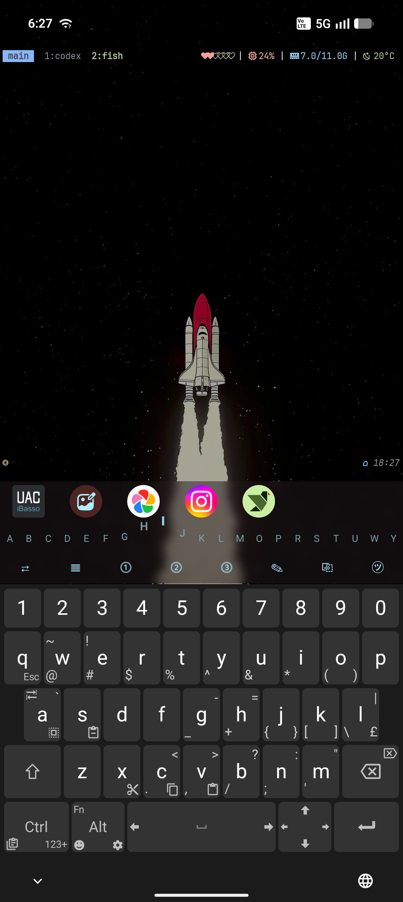
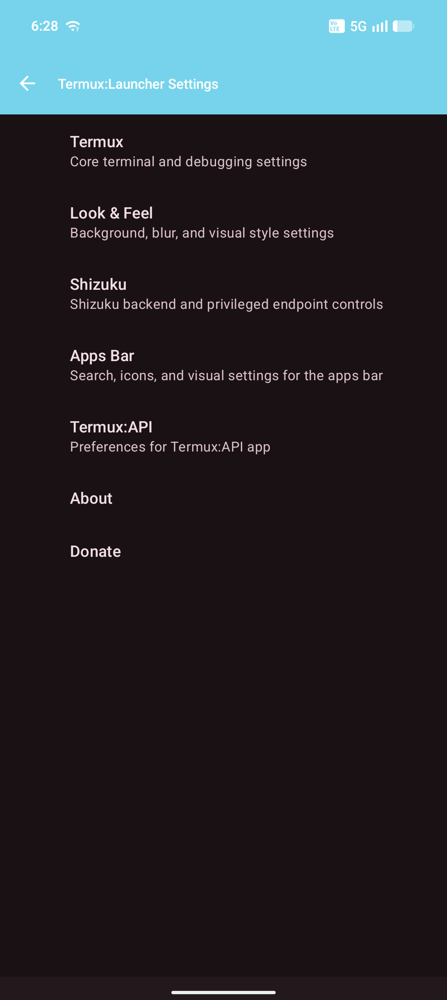
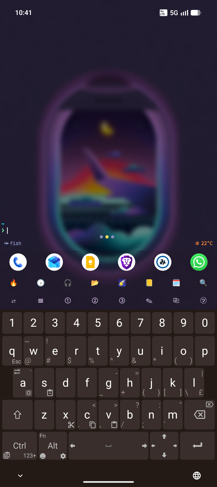
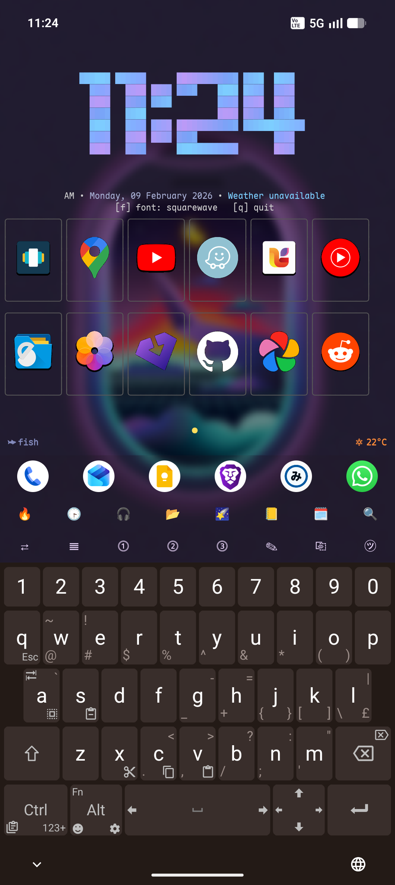
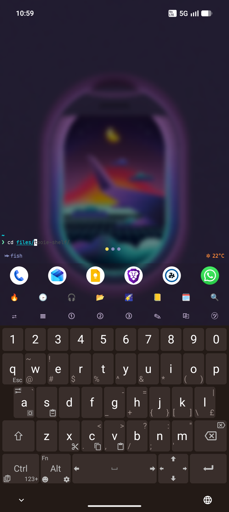

# Termux Launcher

Vibe coded proof of concept Android launcher and terminal app fork based on Termux-Monet, heavily inspired by TEL (Termux Expert Launcher). 

## Primary Difference from TEL;
- Sixel support in terminal.
- Wallpaper implimentation is different due to how it was implimented in Termux-Monet (TEL can make terminal fully transparent, so you can set android live wallpapers and have it show as terminal background if required) but my version sets an in-app wallpaper (same as termux-monet) + uses termux api to sync with system wallpaper so that the monet color themes properly propagates accross the app and the system.

## Credits
- https://github.com/t-e-l/tel
- https://github.com/Termux-Monet/termux-monet
- https://github.com/termux/termux-app


## Screenshots

<p align="center">
  
</p>

| Home | Search | Settings |
| --- | --- | --- |
|  |  |  |

| Blur Home | Shelf | Terminal Environment |
| --- | --- | --- |
|  |  |  |

## Download APK

Use GitHub Actions artifacts.

1. Non-Shizuku build (default)
- Download artifact from the latest successful run on `main`.
- Workflow: `Build nightly` (`.github/workflows/debug_build.yml`).

2. Shizuku integration build
- Download artifact from the latest successful run on `shizuku-integration`.
- Workflow: `Build nightly` (`.github/workflows/debug_build.yml`).

3. Companion Apps (Termux API, Termux Styling etc)
- Download from https://github.com/Termux-Monet/ 

Note: action artifacts require a logged-in GitHub account.

## Shizuku Integration

`shizuku-integration` branch includes privileged backend support and Tooie local API endpoints.

Current Tooie endpoints include:
- `/v1/status`
- `/v1/apps`
- `/v1/media/now-playing`
- `/v1/notifications`
- `/v1/exec` (policy-gated)
- `/v1/screen/lock`

Developer/security notes:
- `docs/en/Tooie_API.md`

## Build (local)

```sh
COMPILE_SDK_OVERRIDE=34 ./gradlew \
  -PcompileSdkVersion=34 \
  -Pandroid.aapt2FromMavenOverride=/data/data/com.termux/files/usr/bin/aapt2 \
  :app:compileDebugJavaWithJavac
```

## Upstream Base

- Upstream Termux app: https://github.com/termux/termux-app

