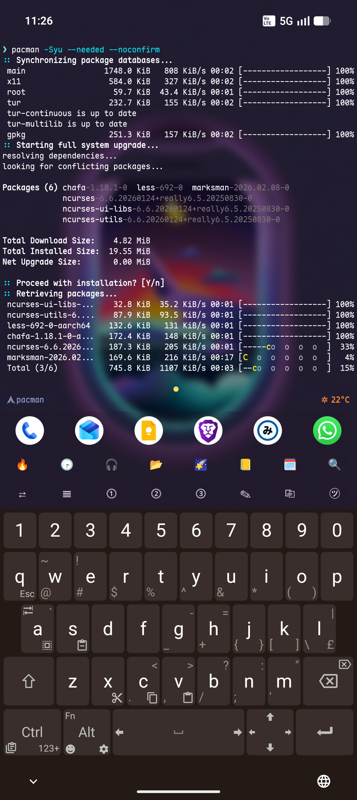
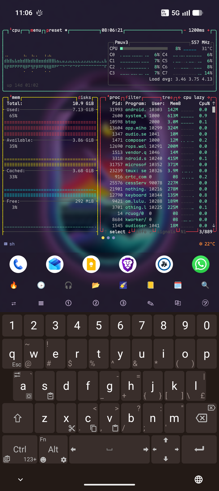
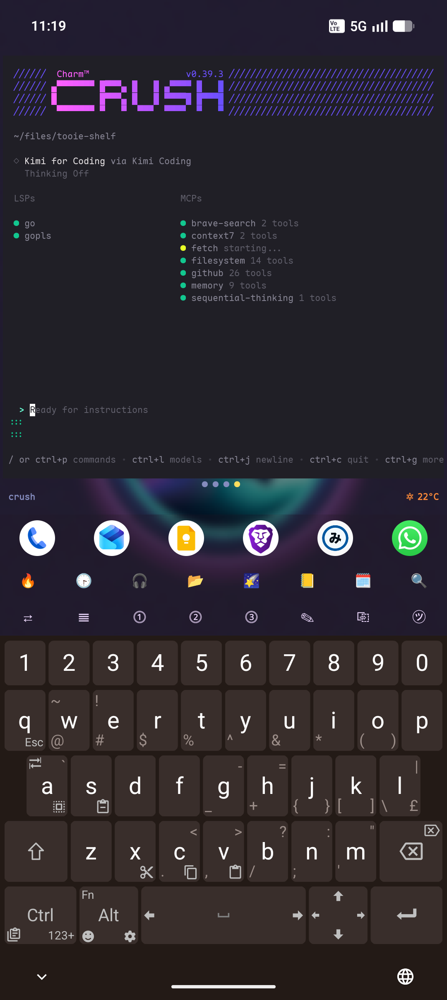
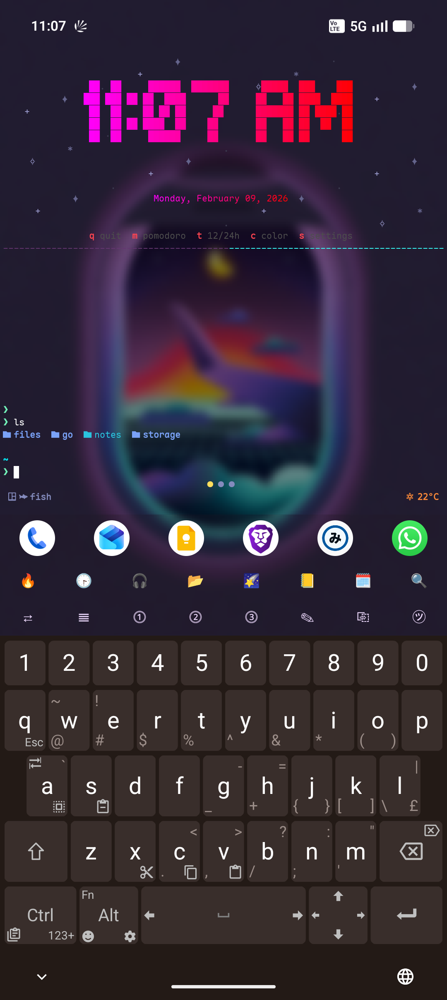
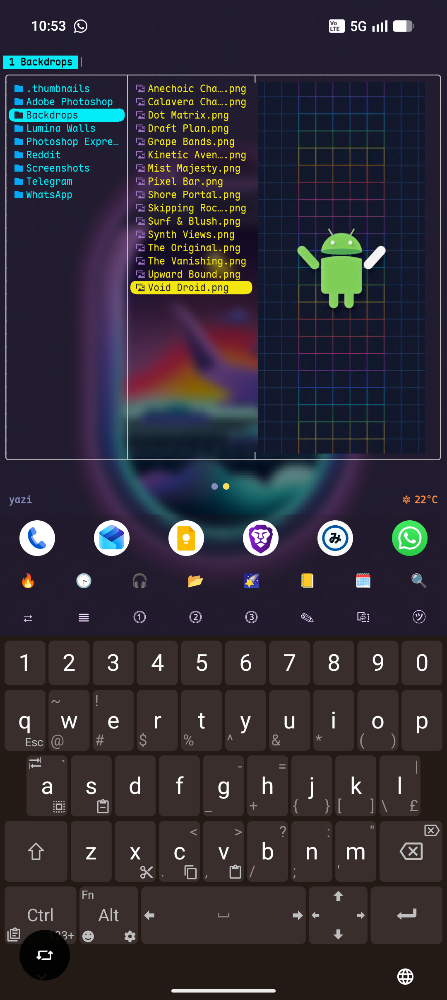
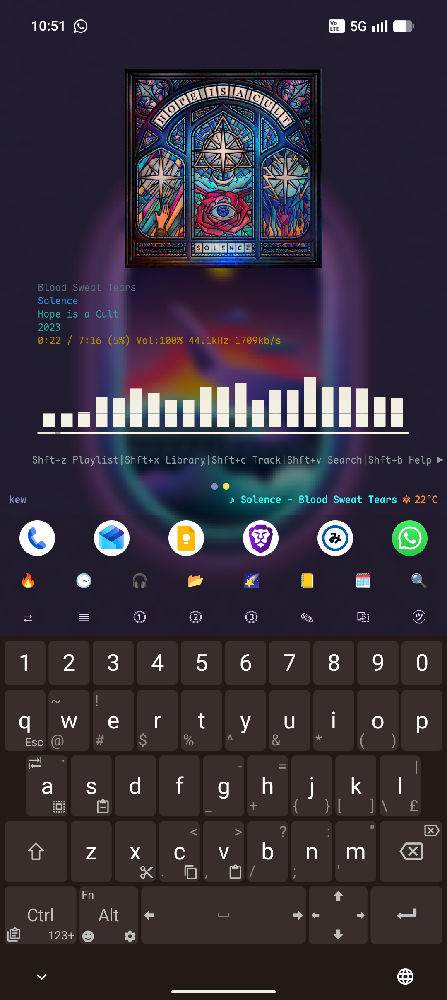
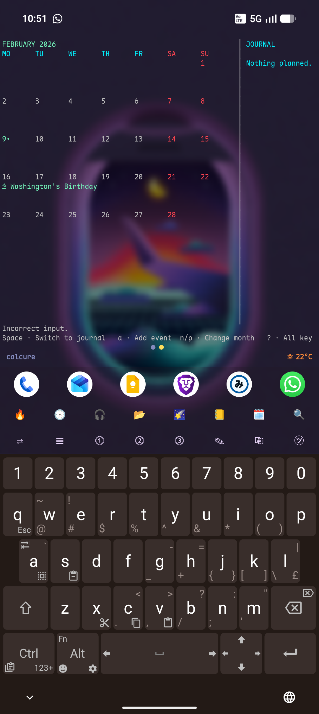

# Termux: Launcher, Tooie

This is a personal proof-of-concept I vibecoded for myself.

It combines ideas from Termux Monet and TEL to make a modern Android launcher workflow that is basically just Termux.

<<<<<<< HEAD
I do not claim credit for upstream work. If a real Android developer wants to take this further, please do.
=======
[Termux](https://termux.dev) is an Android terminal application and Linux environment.
>>>>>>> upstream/master

<p align="center">
  
</p>

## Credits

- Termux app: https://github.com/termux/termux-app
- Termux Monet: https://github.com/Termux-Monet/termux-monet
- TEL project: https://github.com/t-e-l/tel

## Included Files

Everything below is bundled in this repo under `resources/`:

| Type | Path |
| --- | --- |
| Fish config | `resources/config/fish/config.fish` |
| Tmux config | `resources/config/tmux/.tmux.conf` |
| Termux properties | `resources/config/termux/termux.properties` |
| Unexpected Keyboard layout | `resources/config/termux/unexp-keyb-layout.txt` |
| Tooie mascot image | `resources/assets/tooie.png` |
| btop restore script | `resources/scripts/restore_btop.sh` |
| tmux status script (kew ticker) | `resources/scripts/statusbar/kew-now-playing` |
| tmux status script (weather ticker) | `resources/scripts/statusbar/weather-cache` |
| `termux-restart` helper | `resources/bin/termux-restart` |
| Pacman bootstrap reference | `resources/optional/termux-init/bootstrap.md` |
| Neovim Termux LSP config | `resources/optional/termux-init/nvim/termux.lua` |
| Crush LSP + MCP config example | `resources/optional/termux-init/crush/crush.example.json` |
| Shell package module reference | `resources/optional/termux-init/modules/packages.sh` |
| Fish shell module reference | `resources/optional/termux-init/modules/shell.sh` |
| Fish plugins list reference | `resources/optional/termux-init/fish/fish_plugins` |

<<<<<<< HEAD
## User Guide
=======
## Contents
- [Termux App and Plugins](#termux-app-and-plugins)
- [Installation](#installation)
- [Uninstallation](#uninstallation)
- [Important Links](#important-links)
- [Debugging](#debugging)
- [For Maintainers and Contributors](#for-maintainers-and-contributors)
- [Forking](#forking)
- [Sponsors and Funders](#sponsors-and-funders)
##
>>>>>>> upstream/master

### 1) Install baseline dependencies

<<<<<<< HEAD
```sh
pkg update && pkg upgrade -y
pkg install -y fish tmux termux-api git curl zoxide
=======

## Termux App and Plugins

The core [Termux](https://github.com/termux/termux-app) app comes with the following optional plugin apps.

- [Termux:API](https://github.com/termux/termux-api)
- [Termux:Boot](https://github.com/termux/termux-boot)
- [Termux:Float](https://github.com/termux/termux-float)
- [Termux:Styling](https://github.com/termux/termux-styling)
- [Termux:Tasker](https://github.com/termux/termux-tasker)
- [Termux:Widget](https://github.com/termux/termux-widget)
##


## Installation

Latest version is `v0.118.3`.

**NOTICE: It is highly recommended that you update to `v0.118.0` or higher ASAP for various bug fixes, including a critical world-readable vulnerability reported [here](https://termux.github.io/general/2022/02/15/termux-apps-vulnerability-disclosures.html). See [below](#google-play-store-experimental-branch) for information regarding Termux on Google Play.**

Termux can be obtained through various sources listed below for **only** Android `>= 7` with full support for apps and packages.

Support for both app and packages was dropped for Android `5` and `6` on [2020-01-01](https://www.reddit.com/r/termux/comments/dnzdbs/end_of_android56_support_on_20200101/) at `v0.83`, however it was re-added just for the app *without any support for package updates* on [2022-05-24](https://github.com/termux/termux-app/pull/2740) via the [GitHub](#github) sources. Check [here](https://github.com/termux/termux-app/wiki/Termux-on-android-5-or-6) for the details.

The APK files of different sources are signed with different signature keys. The `Termux` app and all its plugins use the same [`sharedUserId`](https://developer.android.com/guide/topics/manifest/manifest-element) `com.termux` and so all their APKs installed on a device must have been signed with the same signature key to work together and so they must all be installed from the same source. Do not attempt to mix them together, i.e do not try to install an app or plugin from `F-Droid` and another one from a different source like `GitHub`. Android Package Manager will also normally not allow installation of APKs with different signatures and you will get errors on installation like `App not installed`, `Failed to install due to an unknown error`, `INSTALL_FAILED_UPDATE_INCOMPATIBLE`, `INSTALL_FAILED_SHARED_USER_INCOMPATIBLE`, `signatures do not match previously installed version`, etc. This restriction can be bypassed with root or with custom roms.

If you wish to install from a different source, then you must **uninstall any and all existing Termux or its plugin app APKs** from your device first, then install all new APKs from the same new source. Check [Uninstallation](#uninstallation) section for details. You may also want to consider [Backing up Termux](https://wiki.termux.dev/wiki/Backing_up_Termux) before the uninstallation so that you can restore it after re-installing from Termux different source.

In the following paragraphs, *"bootstrap"* refers to the minimal packages that are shipped with the `termux-app` itself to start a working shell environment. Its zips are built and released [here](https://github.com/termux/termux-packages/releases).

### F-Droid

Termux application can be obtained from `F-Droid` from [here](https://f-droid.org/en/packages/com.termux/).

You **do not** need to download the `F-Droid` app (via the `Download F-Droid` link) to install Termux. You can download the Termux APK directly from the site by clicking the `Download APK` link at the bottom of each version section.

It usually takes a few days (or even a week or more) for updates to be available on `F-Droid` once an update has been released on `GitHub`. The `F-Droid` releases are built and published by `F-Droid` once they [detect](https://gitlab.com/fdroid/fdroiddata/-/blob/master/metadata/com.termux.yml) a new `GitHub` release. The Termux maintainers **do not** have any control over the building and publishing of the Termux apps on `F-Droid`. Moreover, the Termux maintainers also do not have access to the APK signing keys of `F-Droid` releases, so we cannot release an APK ourselves on `GitHub` that would be compatible with `F-Droid` releases.

The `F-Droid` app often may not notify you of updates and you will manually have to do a pull down swipe action in the `Updates` tab of the app for it to check updates. Make sure battery optimizations are disabled for the app, check https://dontkillmyapp.com/ for details on how to do that.

Only a universal APK is released, which will work on all supported architectures. The APK and bootstrap installation size will be `~180MB`. `F-Droid` does [not support](https://github.com/termux/termux-app/pull/1904) architecture specific APKs.

### GitHub

Termux application can be obtained on `GitHub` either from [`GitHub Releases`](https://github.com/termux/termux-app/releases) for version `>= 0.118.0` or from [`GitHub Build Action`](https://github.com/termux/termux-app/actions/workflows/debug_build.yml?query=branch%3Amaster+event%3Apush) workflows. **For android `>= 7`, only install `apt-android-7` variants. For android `5` and `6`, only install `apt-android-5` variants.**

The APKs for `GitHub Releases` will be listed under `Assets` drop-down of a release. These are automatically attached when a new version is released.

The APKs for `GitHub Build` action workflows will be listed under `Artifacts` section of a workflow run. These are created for each commit/push done to the repository and can be used by users who don't want to wait for releases and want to try out the latest features immediately or want to test their pull requests. Note that for action workflows, you need to be [**logged into a `GitHub` account**](https://github.com/login) for the `Artifacts` links to be enabled/clickable. If you are using the [`GitHub` app](https://github.com/mobile), then make sure to open workflow link in a browser like Chrome or Firefox that has your GitHub account logged in since the in-app browser may not be logged in.

The APKs for both of these are [`debuggable`](https://developer.android.com/studio/debug) and are compatible with each other but they are not compatible with other sources.

Both universal and architecture specific APKs are released. The APK and bootstrap installation size will be `~180MB` if using universal and `~120MB` if using architecture specific. Check [here](https://github.com/termux/termux-app/issues/2153) for details.

**Security warning**: APK files on GitHub are signed with a test key that has been [shared with community](https://github.com/termux/termux-app/blob/master/app/testkey_untrusted.jks). This IS NOT an official developer key and everyone can use it to generate releases for own testing. Be very careful when using Termux GitHub builds obtained elsewhere except https://github.com/termux/termux-app. Everyone is able to use it to forge a malicious Termux update installable over the GitHub build. Think twice about installing Termux builds distributed via Telegram or other social media. If your device get caught by malware, we will not be able to help you.

The [test key](https://github.com/termux/termux-app/blob/master/app/testkey_untrusted.jks) shall not be used to impersonate @termux and can't be used for this anyway. This key is not trusted by us and it is quite easy to detect its use in user generated content.

<details>
<summary>Keystore information</summary>

```
Alias name: alias
Creation date: Oct 4, 2019
Entry type: PrivateKeyEntry
Certificate chain length: 1
Certificate[1]:
Owner: CN=APK Signer, OU=Earth, O=Earth
Issuer: CN=APK Signer, OU=Earth, O=Earth
Serial number: 29be297b
Valid from: Wed Sep 04 02:03:24 EEST 2019 until: Tue Oct 26 02:03:24 EEST 2049
Certificate fingerprints:
         SHA1: 51:79:55:EA:BF:69:FC:05:7C:41:C7:D3:79:DB:BC:EF:20:AD:85:F2
         SHA256: B6:DA:01:48:0E:EF:D5:FB:F2:CD:37:71:B8:D1:02:1E:C7:91:30:4B:DD:6C:4B:F4:1D:3F:AA:BA:D4:8E:E5:E1
Signature algorithm name: SHA1withRSA (disabled)
Subject Public Key Algorithm: 2048-bit RSA key
Version: 3
>>>>>>> upstream/master
```

For the fuller dependency set, see:
- `resources/optional/termux-init/modules/packages.sh`
- `resources/optional/termux-init/modules/shell.sh`
- `resources/optional/termux-init/fish/fish_plugins`

### 2) Copy configs and helpers

```sh
mkdir -p ~/.config/fish ~/.termux ~/files/btop ~/.local/bin
cp resources/config/fish/config.fish ~/.config/fish/config.fish
cp resources/config/tmux/.tmux.conf ~/.tmux.conf
cp resources/config/termux/termux.properties ~/.termux/termux.properties
cp resources/scripts/restore_btop.sh ~/files/btop/restore_btop.sh
cp resources/scripts/statusbar/kew-now-playing ~/.local/bin/kew-now-playing
cp resources/scripts/statusbar/weather-cache ~/.local/bin/weather-cache
cp resources/bin/termux-restart $PREFIX/bin/termux-restart
chmod +x ~/files/btop/restore_btop.sh ~/.local/bin/kew-now-playing ~/.local/bin/weather-cache $PREFIX/bin/termux-restart
termux-reload-settings
```

### 3) Optional keyboard layout (Unexpected Keyboard)

- Install Unexpected Keyboard:
  https://play.google.com/store/apps/details?id=juloo.keyboard2
- Import/use the included layout file:
  `resources/config/termux/unexp-keyb-layout.txt`

### 4) App settings to configure

- Enable wallpaper sync so system wallpaper and in-app wallpaper stay aligned (Monet works better).
- Set an uncommon input split character, for example `@` or `#`, to trigger Android app search via suggestions bar.
- Set default apps as comma-separated values, for example:
  `phone,whatsapp,chrome`
- Set wallpaper from inside the app:
  long-press terminal -> Style -> Background.
- For more styling and behavior details (this app is roughly 90% Termux-Monet, with app suggestion bar and blur-view additions), see:
  https://github.com/Termux-Monet/termux-monet

### 5) Optional references (manual, not automated)

<<<<<<< HEAD
The `termux-init` flow is currently not functioning end-to-end here.
Use these files as reference only:
- `resources/optional/termux-init/bootstrap.md`
- `resources/optional/termux-init/nvim/termux.lua`
- `resources/optional/termux-init/crush/crush.example.json`
- https://github.com/PickleHik3/termux-init

## Keybinds

### Fish keybinds (`resources/config/fish/config.fish`)

| Key | Action |
| --- | --- |
| `Alt+e` | Send current command to `aichat` (`_aichat_fish`) |

### Tmux keybinds (`resources/config/tmux/.tmux.conf`)

| Key | Action |
| --- | --- |
| `Prefix` = `Ctrl+b` | Main tmux prefix |
| `Alt+1..9` | Jump to window 1..9 |
| `Alt+c` | New window |
| `Alt+x` | Kill current window |
| `Alt+z` | Last active window |
| `Alt+r` | Replace current window (new + kill previous) |
| `Alt+Arrow` | Move between panes |
| `Prefix + |` | Split pane horizontally |
| `Prefix + -` | Split pane vertically |
| `Prefix + R` | Reload tmux config |
| `Ctrl+Space` | Launch BlueLineConsole (Omnisearch) |
| `Alt+w` | Launch WhatsApp |
| `Alt+y` | Launch YouTube |
| `Alt+b` | Launch Brave |
| `Alt+t` | Launch Mihon |
| `Alt+f` | Launch Solid Explorer |
| `Alt+s` | Launch Android Settings |
| `Alt+Space` | Launch BlueLineConsole |

### Termux extra-keys (`resources/config/termux/termux.properties`)

| Extra key | Sends | Result |
| --- | --- | --- |
| `🔥` | `Ctrl+b` `Backspace` | Open btop mini window |
| `🕞` | `Ctrl+b` `Tab` | Open peaclock |
| `🎧` | `Ctrl+b` `Esc` | Open kew |
| `📂` | `Ctrl+b` `Enter` | Open yazi |
| `🌠` | `Ctrl+b` `Del` | Open crush |
| `📒` | `Ctrl+b` `PgUp` | Open nvim |
| `🗓️` | `Ctrl+b` `PgDn` | Open calcure |
| `🔍` | `Ctrl+b` `End` | Launch BlueLineConsole |
| `⇄` | `Alt+z` | Switch to last tmux window |
| `𝍣` | `Ctrl+b` `-` | Split pane vertically |
| `𝍬` (popup) | `Ctrl+b` `|` | Split pane horizontally |
| `⓵` `⓶` `⓷` | `Ctrl+b` `1/2/3` | Switch tmux window |
| `✎` | `Ctrl+b` `[` | Enter copy mode |
| `㋡` | `Ctrl+b` | Prefix helper key |

## Quirks And Limitations

- `tooie-shelf` is experimental and not fully functional in this setup:
  https://github.com/PickleHik3/tooie-shelf
- Install `termux-api` for wallpaper sync-to-system features.
- In settings, keep terminal margin adjustment OFF:
  `Termux:Launcher -> Terminal View -> Terminal Margin Adjustment`.
  If enabled, extra-keys bar and app suggestions may flicker while interacting.
- `btop` needs Shizuku + `rish`, plus generic Linux btop from:
  https://github.com/aristocratos/btop/releases
  Then use `resources/scripts/restore_btop.sh`.
- tmux status-right expects:
  - `~/.local/bin/kew-now-playing`
  - `~/.local/bin/weather-cache`
- `weather-cache` uses `Kuwait` by default; edit the script to change city.
- If shell exit causes stutter, force close app or run `termux-restart`.
- Termux:X11 currently does not work well with this setup.
- Battery usage is untested; on my Nothing Phone 2 it has been mostly fine.
- Pacman/TUR guide:
  https://wiki.termux.com/wiki/Switching_package_manager
- Users are encouraged to build APKs themselves or use nightly workflow artifacts.

## TUI Apps (from `tui.txt`)

- https://github.com/charmbracelet/crush
- https://github.com/am2rican5/sigye
- https://github.com/octobanana/peaclock
- https://github.com/sxyazi/yazi
- https://github.com/ravachol/kew
- https://github.com/anufrievroman/calcure
- https://github.com/antonmedv/walk
- More TUIs: https://terminaltrove.com/

## Screenshots

<table>
  <tr>
    <td></td>
    <td></td>
  </tr>
  <tr>
    <td></td>
    <td></td>
  </tr>
  <tr>
    <td></td>
    <td></td>
  </tr>
  <tr>
    <td></td>
    <td></td>
  </tr>
  <tr>
    <td></td>
    <td></td>
  </tr>
  <tr>
    <td></td>
    <td></td>
  </tr>
  <tr>
    <td></td>
    <td></td>
  </tr>
  <tr>
    <td colspan="2" align="center"></td>
  </tr>
</table>
=======
- Check [`TermuxConstants`](https://github.com/termux/termux-app/blob/master/termux-shared/src/main/java/com/termux/shared/termux/TermuxConstants.java) javadocs for instructions on what changes to make in the app to change package name.
- You also need to recompile bootstrap zip for the new package name. Check [building bootstrap](https://github.com/termux/termux-packages/wiki/For-maintainers#build-bootstrap-archives), [here](https://github.com/termux/termux-app/issues/1983) and [here](https://github.com/termux/termux-app/issues/2081#issuecomment-865280111).
- Currently, not all plugins use `TermuxConstants` from `termux-shared` library and have hardcoded `com.termux` values and will need to be manually patched.
- If forking termux plugins, check [Forking and Local Development](https://github.com/termux/termux-app/wiki/Termux-Libraries#forking-and-local-development) for info on how to use termux libraries for plugins.
##


## Sponsors and Funders

[](https://github.com)  
*[GitHub Accelerator](https://github.com/accelerator) ([1](https://github.blog/2023-04-12-github-accelerator-our-first-cohort-and-whats-next))*

&nbsp;

[](https://github.com)  
*[GitHub Secure Open Source Fund](https://resources.github.com/github-secure-open-source-fund) ([1](https://github.blog/open-source/maintainers/securing-the-supply-chain-at-scale-starting-with-71-important-open-source-projects), [2](https://termux.dev/en/posts/general/2025/08/11/termux-selected-for-github-secure-open-source-fund-session-2.html))*

&nbsp;

[](https://nlnet.nl/mobifree)  
*[NLnet NGI Mobifree](https://nlnet.nl/mobifree) ([1](https://nlnet.nl/news/2024/20241111-NGI-Mobifree-grants.html), [2](https://termux.dev/en/posts/general/2024/11/11/termux-selected-for-nlnet-ngi-mobifree-grant.html))*

&nbsp;

[](https://www.cloudflare.com)  
*[Cloudflare](https://www.cloudflare.com) ([1](https://packages-cf.termux.dev))*

&nbsp;

[](https://www.warp.dev/?utm_source=github&utm_medium=readme&utm_campaign=termux)  
[*Warp, built for coding with multiple AI agents*](https://www.warp.dev/?utm_source=github&utm_medium=readme&utm_campaign=termux)
>>>>>>> upstream/master
