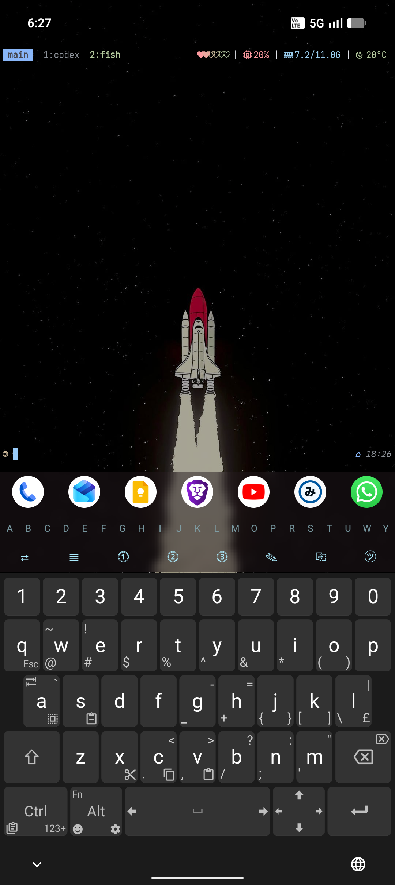
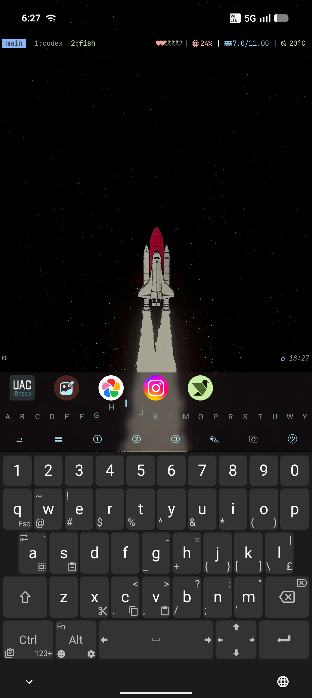
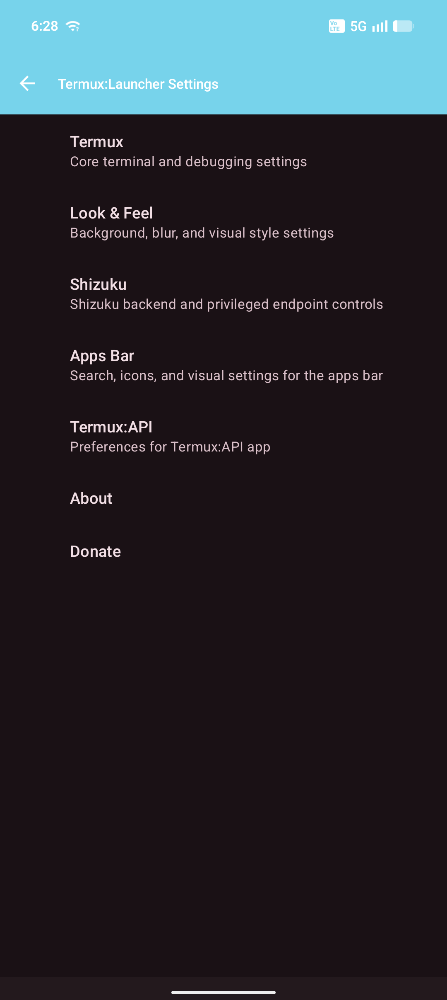

# Termux Launcher

Android launcher and terminal app fork based on Termux, focused on launcher UX and privileged integrations.

This repository now contains only Android app source and related app assets.
Shell dotfiles/config bundles (tmux, fish, nvim) are intentionally not part of this repo.

If you want to recreate the broader shell/TUI environment shown in some screenshots, use the optional Tooie companion repo:

- https://github.com/PickleHik3/tooie

## Screenshots

<p align="center">
  
</p>

| Home | Search | Settings |
| --- | --- | --- |
|  |  |  |

## Download APK

Use GitHub Actions artifacts.

1. Recommended install build
- Download artifact from the latest successful run on `main`.
- Workflow: `Build nightly` (`.github/workflows/debug_build.yml`).

Note: action artifacts require a logged-in GitHub account.

For a tagged APK release build, use a GitHub release backed by the `Attach Debug APKs To Release` workflow.

## Shizuku Integration

Shizuku privileged backend support and Tooie local API endpoints are included in `main`.

Current Tooie endpoints include:
- `/v1/status`
- `/v1/apps`
- `/v1/system/resources` (CPU, memory, storage, battery, network, thermal, backend diagnostics)
- `/v1/media/now-playing`
- `/v1/media/art` (now-playing album art payload)
- `/v1/notifications`
- `/v1/system/brightness` (read/set screen brightness)
- `/v1/system/volume` (read/set stream volume)
- `/v1/exec` (policy-gated)
- `/v1/privileged/request-permission`
- `/v1/screen/lock`
- `/v1/auth/rotate`

Docs and policy notes:
- `docs/en/Tooie_API.md`

## Build (local)

```sh
COMPILE_SDK_OVERRIDE=34 ./gradlew \
  -PcompileSdkVersion=34 \
  -Pandroid.aapt2FromMavenOverride=/data/data/com.termux/files/usr/bin/aapt2 \
  :app:compileDebugJavaWithJavac
```

## Upstream Base

- Upstream Termux app: https://github.com/termux/termux-app

## Acknowledgements

- `TEL`: launcher direction and launcher-focused Termux experimentation
  https://github.com/t-e-l/tel
- `termux-monet`: wallpaper-driven theming direction and related customization ideas
  https://github.com/Termux-Monet/termux-monet
- `termux-app`: upstream Android app base this fork builds on
  https://github.com/termux/termux-app

## Companion Apps (Forks)

Use companion apps from this project owner to match launcher signing/source:

- Termux:API fork: https://github.com/PickleHik3/termux-api
- Termux:Styling fork: https://github.com/PickleHik3/termux-styling

Install launcher + companion apps from the same source set to avoid shared UID/signature incompatibility.
